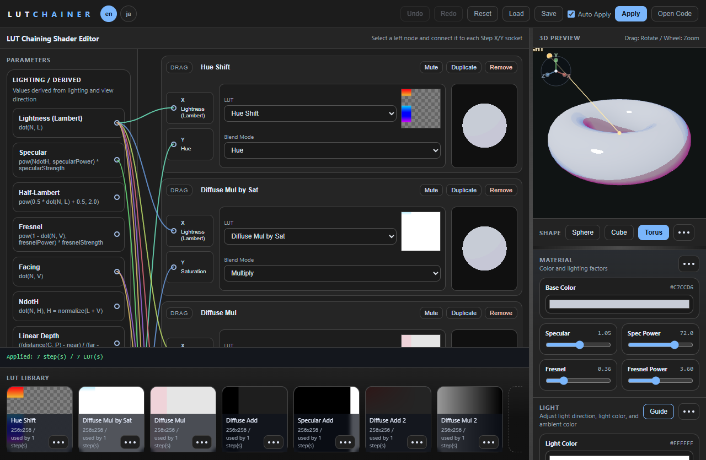
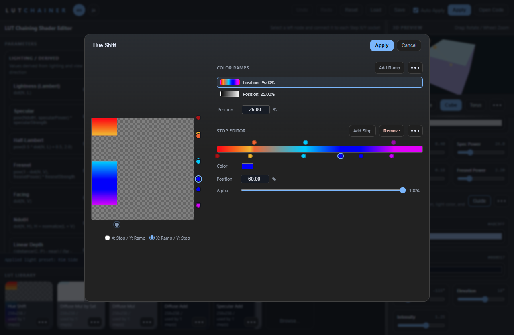

# LUT Chainer - Browser-based LUT Chaining Shader Editor

[日本語版](README.ja.md) | [English](README.md)

A browser-based shader editor for creating LUT (Look-Up Table) based step chains. Combine multiple LUTs and blend modes sequentially, then preview your changes in real-time with a 3D renderer.

## Screenshots

<p align="center">
	
	
</p>

## Key Features

- **LUT Step Chain Editing**
	- Add/remove/reorder steps
	- Add/remove/reorder LUT images
	- Configure blend mode, X/Y input parameters, and channel operations (customRgb/customHsv) per step
- **Real-time 3D Preview**
	- Shape presets: Sphere / Cube / Torus
	- Mouse drag to rotate, scroll wheel to zoom
	- Light direction guide and axis gizmo overlay
- **Material & Light Parameter Controls**
	- Base Color, Ambient, Diffuse, Specular, Spec Power, Fresnel, Fresnel Power
	- Light Azimuth / Elevation, guide visibility toggle
- **Generated Code Export**
	- GLSL Fragment / GLSL Vertex / HLSL tabs with syntax highlighting
	- Copy to clipboard
- **Pipeline Save & Load**
	- Export/import as `.lutchain` format (ZIP-based)
	- LUT images embedded as PNG files within the archive
- **Undo/Redo History**

## UI Layout

- **Left Panel**
	- Parameters: Connection source parameter nodes
	- Step List: Per-step configuration and preview
	- LUT Library: LUT image management
- **Right Panel**
	- 3D Preview canvas
	- Material / Light settings
	- Generated Shader modal dialog

## Setup

### With Nix Flakes (Recommended)

```bash
# Enter development shell
nix develop

# Install dependencies and build
npm install
npm run build
```

### With Node.js

```bash
npm install
npm run build
```

## Running

To use all features including example `.lutchain` file loading, serve the app via a local HTTP server.

### Via Local Server (Recommended)

```bash
# Build first
npm run build

# Start server
npm run serve
# Open http://localhost:8000
```

**Note**: Direct `file://` opening does not support example loading due to browser CORS restrictions.

### Via Nix

```bash
nix run -- --help
nix run -- serve
# Open http://localhost:8000
```

### Build Artifacts Only

```bash
nix build
# Output: result/ with dist/web/ and dist/cli/
```

## Usage Workflow

1. Add LUT images in the LUT Library panel
2. Add steps and configure each one: select LUT, blend mode, X & Y parameters
3. Optionally configure customRgb / customHsv channel operations per step
4. With Auto-Apply ON, changes apply instantly; with OFF, click "Apply" to update
5. Click "Open Code" to view and copy GLSL/HLSL
6. Click "Save" to export as a `.lutchain` file

### Keyboard Shortcuts

| Shortcut | Action |
|----------|--------|
| `Ctrl+Z` / `Cmd+Z` | Undo |
| `Ctrl+Shift+Z` / `Cmd+Shift+Z` | Redo |
| `Ctrl+Y` / `Cmd+Y` | Redo (Alternative) |

## Limits

- Maximum steps: 32
- Maximum LUTs: 12
- LUT image file size limit: 12MB per image
- Pipeline JSON limit: 64MB
- Maximum loadable LUT image dimension: 4096px

## Development

```bash
npm run dev
```

Changing the browser entrypoint rebuilds `dist/web/bundle.js`, and CLI changes rebuild `dist/cli/main.mjs`.

The browser build outputs to `dist/web/`, and the CLI is emitted to `dist/cli/`.

CLI examples:

```bash
lutchainer serve
lutchainer serve --port 8000
lutchainer lut list examples/Metallic.lutchain
```

Type checking only:

```bash
npx tsc --noEmit
```

## Nix Notes

When updating `package-lock.json`, regenerate `npmDepsHash` in `flake.nix`:

```bash
nix run nixpkgs#prefetch-npm-deps -- package-lock.json
```
